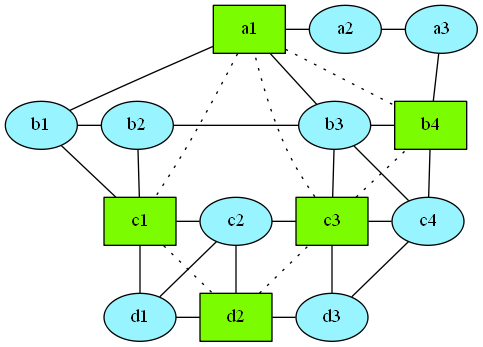
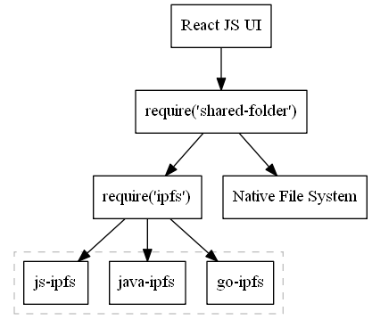

# What is this?
Think about a shared folder on an FTP server where many users can add files. In this folder there is also a special `rules` script that enforces certain rules about what files can be added, who can add them and so on. This shared folder has some disadvantages: there is an admin who is above the rules and all the files are stored in one place. The idea of this project is to use [IPFS](https://ipfs.io) to implement this shared folder pattern without the disadvantages: there won't be an admin and there won't be a single place where the files are stored.

Why not to use IPFS directories? They are immutable. An IPFS directory is just a immutable IPFS file that has links to other IPFS files and directories. An IPFS directory can be thought of as an immutable JSON object where leafs are IPFS files.

What about [ipfs files](https://docs.ipfs.io/reference/api/cli/#ipfs-files)? That's just a more convenient API to create immutable IPFS directories.

# How this is supposed to be used

Say we want to start a reddit-like forum about cats:

- We `git clone` this project.
- Give it a unique id that will serve as the id of the shared folder.
- Write the `rules` script that will validate each cat before it's posted.
- Compile everything into an Android or iOS app.
- Publish the app and let users download it.
- Each app instance uses the folder id to find other users of the forum.



In this diagram:

- All the nodes are IPFS nodes.
- Square green nodes participate in the same forum.
- Solid lines are IPFS connections between nodes.
- Dotted lines are additional IPFS connections discovered by the forum nodes.

This means that when `a1` wants to add a new file in the forum, it sends its hash to `c1`, `c3` and `b4` and they later send it to `d2`.

The `rules` script can be arbitrarily complex:

- It may just check that a new post contains a description of length 200-500 words.
- It may check that the description has a valid URL to a cat picture.
- It may actually download that URL, check the size of the downloaded picture and its format.
- It may even run an ML model to verify that the picture contains a cat and not something else.
- It may contact a captcha service and sign the post with a RSA key if the user answered the captcha correctly.

## Internal structure

What a shared folder actually is? It consists of two things:

- A network of nodes who participate in this shared folder. This is a subset of the IPFS nodes.
- Each node has a local copy of the shared folder. This copy is partial.

For simplicity of design (and to make it possible at all), we only allow to add files: the protocol won't allow to remove files or edit them. Thus the complete up to date copy of the shared folder is the union of all the local copies. This complete up to date copy can never be created, though: all the nodes are never online and never stop adding files. Adding a file in this network looks like a wave: there can be multiple waves and the add-only property allows these waves to go thru each other.

The add-only property is a significant restriction, but it doesn't impact forum-like sites much because everything there is usually written once. It would be much better to have a decentralised git repository editable by everyone with correctness enforced by a pre-submit script. We'd essentially need to implement a peer-to-peer `git pull --rebase && git push` where the remote peer isn't trusted. I don't see a way to make such a system work.

Now the internal repsentation of a local copy of the shared folder: it's just a flat list of IPFS files:

```
0073ff # { name:"RULES",            data:"os.exit(0)" }
828990 # { name:"foo/abc",          data:"123" }
8bcc62 # { name:"foo/bar",          data:"Hello world!" }
c7aff2 # { name:"test12",           data:"11" }
883000 # { name:"config/data.json", data:"{}" }
```

The fact that it's a flat list doesn't mean that it can only represent flat shared folders. Each file contains two parts:
- `name` - it's a string that looks like `foo/bar`.
- `data` - this is the actual content, like a markdown file.

For example:

```
$ ipfs ls 8bcc62
bc0087  7 name
771caf 12 data

$ ipfs cat bc0087
foo/bar

$ ipfs cat 771caf
Hello world!
```

In other words, a shared folder can be thought of as a list of JSON objects, where each JSON object has `name` and `data` fields. In IPFS terms every text string is a file that has its own hash (IPFS CID) and a group of such fields is called an IPFS directory which has its own hash.

In practice, this dictionary is stored like a usual dir in a local file system, while the IPFS hashes are used to transmit data between peers:

```
RULES
foo/
  bar
  abc
test12
config/
  data.json
```

## The rules script

Every shared folder has the `RULES` script that verifies every new file before adding it locally. This script is immutable, just like any other IPFS file. Thus if a mistake is made in it, it cannot be fixed later. However this rules script can contain a minimum bootstrap code that goes to the folder called `scripts` for example, looks there for a specific file and runs it. The rules can be as simple as verifying that every new file has a signature, while the public RSA key is hardcoded in the script.

In addition to this, the files have a specific order. This is important because `RULES` may accept files if they are added in one order and reject them if they are added in another order. Simple example: if we add first `admins/mrsmith` and then `users/johndoe`, the `RULES` script approves this, but if we add the user first, the script will complain that there are no admins to approve this user.

> Hard question. Two nodes, A and B, have two slightly different sets of files added in different order. What's the correct way to merge them? I feel the smell of [Operational Transformation](https://en.wikipedia.org/wiki/Operational_transformation) here.

> Why not to use the same format [.git](https://git-scm.com/book/en/v2/Git-Internals-Plumbing-and-Porcelain) uses? This would enable all the tools written for git.

## Typical examples of such shared folders

This is a list of typical forum models used on different websites.

### Anybody can post, moderators can ban users and hide posts

The structure of such a forum can look like this:

```
RULES
moderators/
  mrsmith
  johndoe
users/
  1ec45d
  629bfd
  009ff2
  177bbc
banned-users/
  629bfd
hidden-comments/
  882bc5
posts/
  772781/
    README
    comments/
      bbc621
      882bc5
      889900
  20019c/
    README
    comments/
```

The rules ensure the following:

- Only the admin can add files to `moderators` dir. The public RSA key of the admin is in the `RULES` script. Since only the admin can add files there, there is no risk of name conflicts and thus files can have meaningful names. Contents of `moderators/mrsmith` may look like this:
  ```
  USER-ID: 177bbc
  SIGNED-BY: admin b00..17c
  ```
- Anybody can add files to `users` dir. Well, the rules present a captcha or something like that to prevent creating users in batches. Since anybody can add files there, the filename must be a long unique hash, which is ensured by the rules too. Files in the `users` dir contain some user info and their public RSA keys. Contents of `users/177bbc`:
  ```
  DISPLAY-NAME: mrsmith
  PUBLIC-KEY: 63c...887
  ```
- Only moderators can add files to the `banned-users` dir. The rules check that every file there is signed by a public key from the `moderators` dir. This model implies that once a user is banned, it cannot be un-banned. Contents of `banned-users/629bfd`:
  ```
  SIGNED-BY: mrsmith 177bbc 009...725
  ```
- `posts` is editable by those who are in `users` and not in `banned-users`. The dirname should be a hash of the `README` file. As a side effect, posts with the same `README` will be merged. The `README` file should have a signature of the user who added it, as well as the user id:
  ```
  This is my new cat: 
  
  SIGNED-BY: 177bbc 81b...090
  ```
- The same rule for `comments`.
- `hidden-comments` is editable by `moderators` only. As you see, comments cannot be completely removed or forcibly erased from the local storage of every participant. Instead, the UI for that forum hides the comments, but may present an option to unhide them. The UI may also choose to actually erase the hidden comments from the local storage, but can't force others to do the same.

Now how an attacker may compromise this forum. Since files aren't removable, the only way is to spam. Let's assume that the UI for this forum is written in such a way that it actually deletes files in `hidden-comments` once they become too old, so if the spambot succeeds in adding a file there, it will eventually make the network erase the comment completely. The spambot may disable the `RULES` script locally and may add any files in any order, but it will need to convince others to do the same.

- Adding a file to `hidden-comments` will be rejected because the file needs to be signed by someone from `moderators`.
- Adding someone to `moderators` won't work because the spambot can't fake the admin's signature.

Thus a spambot cannot do much harm in this forum.

### Invite-only model

In this forum there is a set of approved users and a set of candidates who want to be approved:

```
RULES
users/
  241800
  288111
  28cbcc
  98ccc8
candidates/
  213322/
    241800
  828cbc/
```

Here `213322` already got approval from `241800` and now can add himself to `users`.

How can we compromise this system? We need to bring our candidate to the `users` group. Just adding `828cbc` to `users` won't work because we can't fake signatures of real users. However we can add locally a fake user whose signature we know and make it sign our candidate, while the candidate can sign our fake user:

```
users/
  111222
  828cbc
candidates/
  111222/
    828cbc
  828cbc/
    111222
```

Now whoever gets to sync with this copy might be confused because from the `RULES` point of view everything looks correct: all candidates have approvals from those who are approved users. This is where the order of the files becomes important. We can't send all the new files in one batch to a peer in the network. Instead, we have to send the files one by one and the peer will verify them one by one. So we have to choose an order in which we'll be sending the files:

- If we add someone to `users` first, the peer will reject this.
- If we try to approve our candidate `828cbc` with `111222`, the peer will notice that there is no `users/111222` file yet.
- If we try to approve our fake user `111222` with `828cbc`, the peer will notice that `828cbc` cannot approve others.

No matter which order we choose, the peer will reject it.

# How this works

Each user runs an IPFS node. When we want to post a new cat, we do the following:

- Run the `rules` script to check that the new cat is ok and meets all the requirements of the forum.
- Use [ipfs add](https://docs.ipfs.io/reference/api/cli/#ipfs-add) to create an IPFS file with the cat's description. IPFS gives us a hash or [CID](https://docs.ipfs.io/guides/concepts/cid) of this file.
- Add the `CID` to the local copy of the shared folder: `/$FID/$CID` where `FID` is the forum id.
- Use [ipfs p2p](https://github.com/ipfs/go-ipfs/blob/master/docs/experimental-features.md#ipfs-p2p) to send the `CID` of the file to a few other users of the forum.
- Each user who receives this message also runs `rules` and if the `CID` is ok, the `CID` is added to the user's copy of the shared folder and gets re-transimtted to the user's peers. The `rules` script likely needs access to the contents of the file: it gets them with [ipfs get](https://docs.ipfs.io/reference/api/cli/#ipfs-get).

Now what happens when someone wants to spam in the forum. The spammer may skip the `rules` check and just send new files to other users. However other users will run the `rules` check, find out that the files are bad and the spammer will be blocked by those users.

## Joining the forum

Say there is already a million users in the forum. Now we download the app, which contains the forum id, and want to find a few other users. We can use [ipfs pubsub](https://docs.ipfs.io/reference/api/cli/#ipfs-pubsub) for that. However if we simply use `ipfs pubsub pub $FID "Hello everyone!"` to let online users reply, we may get a million replies, while we need only a few tens. So we use a more sophisticated discovery protocol:

- `ipfs pubsub pub $FID 1` - only those users reply whose [ipfs id](https://docs.ipfs.io/reference/api/cli/#ipfs-id) differs from ours by 1 bit.
- `ipfs pubsub pub $FID 2` - now only those reply who have 2 different bits in their id.
- `ipfs pubsub pub $FID 3`

...and so on. `ipfs id` values are evenly distributed, so if the length of the id is 256 bits and there are 1 million users online, the number of replies to `ipfs pubsub pub $FID 96` will be `10^6 * C(96,256)/2^256` = [16](http://m.wolframalpha.com/input/?i=10%5E6+*+256%21%2F%282%5E256+*+96%21+*+%28256+-+96%29%21%29), meaning that there are 16 users online whose `ipfs id` has 96 different bits.

This is a somewhat heavy procedure and is only necessary when we need to start from nothing. However once we have a list of other forum users, we can use them to discover more users.

## Syncing the list of files

We have been offline for a day and now want to see what cats have been added since last time we were online. We pick a random online user in our list of peers and want to sync the list of cats. If the list is small, we could just send the lists of file `CID`s, but this doesn't scale. Here is a more sophisticated, but still fairly simple, sync protocol:

- We split our list of cats into two groups: `CID`s that start with `0` and `CID`s that start with `1`. The peer does the same thing.
- We compute hashes of the two groups. So does the peer.
- We exchange with the two hashes. Now we know which of the two groups are different. Maybe both.
- We continue subdividing the groups that differ.
- Once the groups that differ are small enough, we just send the list of `CID`s.

Instead of splitting each group into 2, we can split it into 4 or 8 subgroups. The optimal parameters depend on latency and network speed.

```
      Peer A                 Peer B

06b645 |                          | 06b645
00f4a0 |-> 728112   !=   dd098c <-| 00f4a0
00e0ad |                          | 078f11

141599 |                          | 141599
1d8b4e |                          | 1d8b4e
1a2287 |-> 88ffc2   ==   88ffc2 <-| 1a2287
101114 |                          | 101114
18d1b0 |                          | 18d1b0
```

In this example the two peers see that they have the same set of files whose hashes start with `1`, but different sets of files whose hashes start with `0`, so they continue with splitting the `0` group.

Each of the new files need to be verified by the `rules` script. The order of the files matter. However the order of files is local in each node, since it seems impossible to define a global order of files and make it consistent between all the participants. The sender sends the files one by one in the same order it added them earlier, we run the `rules` script on each new file and add it to the local storage. Of course, a spambot may send the files in any order it wants, but we assume that the `rules` script is written in such a way that changing the order won't help to compromise the system.

# Implementation details

First we need to know where this app needs to run:

- Android and iOS phones.
- Windows and MacOS desktops.
- Websites? Someone who doesn't have an app, could go to one of known gateways, enter `FID` and join. JS can store a very limited amount of data locally: a few MBs at most. P2P connectivity is also not easy in client side JS, even with WebRTC DataChannel.
- Linux servers? This type of forum doesn't need servers that would be always online, however deploying a few servers in key geo locations can help a lot with connectivity and latency. Such servers will be like regular clients, except that they will have much higher storage limits and network bandwidth. It's interesting, that it's possible to arrange a forum where such servers would pay for themselves: every post in the forum would need to have a transaction to a bitcoin wallet associated with the servers and the `rules` script will check validity of the attached transaction id.

Writing code is hard, so the less code the better. We can implement all this logic as a [react native](https://github.com/facebook/react-native) app:

- The IPFS core will go to a RN native module, so `require('ipfs')` will pull
  - [go-ipfs](https://github.com/ipfs/go-ipfs) on desktops and servers.
  - [java-ipfs-api](https://github.com/ipfs/java-ipfs-api) on Android
- The additional logic of discovering forum users and syncing the list of files will go to another RN module.
- The app UI will be written in JS React and present the files in the form of a forum with comments and so on.



Interface of the `ipfs` RN module:

```ts
interface IPFS {
  add(filepath: string): Promise<string>;
  p2p: {
    message: {
      send(nodeid: string, message: string): void;
      listen(callback: (message: string) => void): void;
    }
  },
  pubsub: {
    pub(topic: string, message: string): void;
    sub(topic: string, callback: (message: string) => void): void;
  }
}
```

Interface of the `shared-folder-ipfs` RN module:

```ts
interface LocalSharedFolder {
  id: string;
  add(fileid: string): Promise<void>;
  cat(fileid: string): Promise<string>;
  ls(filter: (fileid: string) => boolean): Promise<string[]>;
  sync(): Promise<void>;
  addEventListener(event: string, callback: (fileid: string) => void): void;
}

interface LocalSharedFolderRepository {
  add(folderid: string): Promise<LocalSharedFolder>;
  remove(folderid: string): Promise<void>;
  list(): Promise<string[]>;  
}
```

# CLI

We can think of a command line interface built on top of the `shared-folder-ipfs` module:

```
$ shdir init
1e3...447
$ shdir set-rules /tmp/rules
$ shdir add /tmp/foo.txt
554...879
$ shdir publish
```
 Under the hood it starts the IPFS daemon.
 
