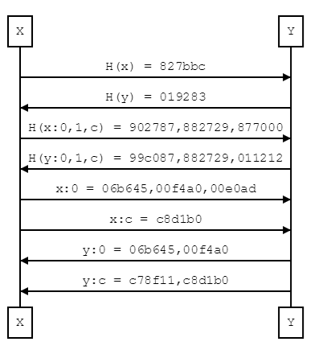

# What is this?
Think about a shared folder on an FTP server where many users can add files. In this folder there is also a special `rules` script that enforces certain rules about what files can be added, who can add them and so on. This shared folder has some disadvantages: there is an admin who is above the rules and all the files are stored in one place. The idea of this project is to use [IPFS](https://ipfs.io) to implement this shared folder pattern without the disadvantages: there won't be an admin and there won't be a single place where the files are stored.

Why not to use IPFS directories? They are immutable. An IPFS directory is just a immutable IPFS file that has links to other IPFS files and directories. An IPFS directory can be thought of as an immutable JSON object where leafs are IPFS files.

What about [ipfs files](https://docs.ipfs.io/reference/api/cli/#ipfs-files)? That's just a more convenient API to create immutable IPFS directories.

# How this is supposed to be used

See [docs/how-to-use.md](docs/how-to-use.md).

## Internal structure

See [docs/internal-structure.md](docs/internal-structure.md).

## The rules script

See [docs/rules-script.md](docs/rules-script.md).

## Typical examples of such shared folders

This is a list of typical forum models used on different websites.

### Anybody can post, moderators can ban users and hide posts

The structure of such a forum can look like this:

```
RULES
moderators/
  mrsmith
  johndoe
users/
  1ec45d
  629bfd
  009ff2
  177bbc
banned-users/
  629bfd
hidden-comments/
  882bc5
posts/
  772781/
    README
    comments/
      bbc621
      882bc5
      889900
  20019c/
    README
    comments/
```

The rules ensure the following:

- Only the admin can add files to `moderators` dir. The public RSA key of the admin is in the `RULES` script. Since only the admin can add files there, there is no risk of name conflicts and thus files can have meaningful names. Contents of `moderators/mrsmith` may look like this:
  ```
  USER-ID: 177bbc
  SIGNED-BY: admin b00..17c
  ```
- Anybody can add files to `users` dir. Well, the rules present a captcha or something like that to prevent creating users in batches. Since anybody can add files there, the filename must be a long unique hash, which is ensured by the rules too. Files in the `users` dir contain some user info and their public RSA keys. Contents of `users/177bbc`:
  ```
  DISPLAY-NAME: mrsmith
  PUBLIC-KEY: 63c...887
  ```
- Only moderators can add files to the `banned-users` dir. The rules check that every file there is signed by a public key from the `moderators` dir. This model implies that once a user is banned, it cannot be un-banned. Contents of `banned-users/629bfd`:
  ```
  SIGNED-BY: mrsmith 177bbc 009...725
  ```
- `posts` is editable by those who are in `users` and not in `banned-users`. The dirname should be a hash of the `README` file. As a side effect, posts with the same `README` will be merged. The `README` file should have a signature of the user who added it, as well as the user id:
  ```
  This is my new cat: 
  
  SIGNED-BY: 177bbc 81b...090
  ```
- The same rule for `comments`.
- `hidden-comments` is editable by `moderators` only. As you see, comments cannot be completely removed or forcibly erased from the local storage of every participant. Instead, the UI for that forum hides the comments, but may present an option to unhide them. The UI may also choose to actually erase the hidden comments from the local storage, but can't force others to do the same.

Now how an attacker may compromise this forum. Since files aren't removable, the only way is to spam. Let's assume that the UI for this forum is written in such a way that it actually deletes files in `hidden-comments` once they become too old, so if the spambot succeeds in adding a file there, it will eventually make the network erase the comment completely. The spambot may disable the `RULES` script locally and may add any files in any order, but it will need to convince others to do the same.

- Adding a file to `hidden-comments` will be rejected because the file needs to be signed by someone from `moderators`.
- Adding someone to `moderators` won't work because the spambot can't fake the admin's signature.

Thus a spambot cannot do much harm in this forum.

### Invite-only model

In this forum there is a set of approved users and a set of candidates who want to be approved:

```
RULES
users/
  241800
  288111
  28cbcc
  98ccc8
candidates/
  213322/
    241800
  828cbc/
```

Here `213322` already got approval from `241800` and now can add himself to `users`.

How can we compromise this system? We need to bring our candidate to the `users` group. Just adding `828cbc` to `users` won't work because we can't fake signatures of real users. However we can add locally a fake user whose signature we know and make it sign our candidate, while the candidate can sign our fake user:

```
users/
  111222
  828cbc
candidates/
  111222/
    828cbc
  828cbc/
    111222
```

Now whoever gets to sync with this copy might be confused because from the `RULES` point of view everything looks correct: all candidates have approvals from those who are approved users. This is where the order of the files becomes important. We can't send all the new files in one batch to a peer in the network. Instead, we have to send the files one by one and the peer will verify them one by one. So we have to choose an order in which we'll be sending the files:

- If we add someone to `users` first, the peer will reject this.
- If we try to approve our candidate `828cbc` with `111222`, the peer will notice that there is no `users/111222` file yet.
- If we try to approve our fake user `111222` with `828cbc`, the peer will notice that `828cbc` cannot approve others.

No matter which order we choose, the peer will reject it.

There is a reasonable concern that if anybody can propose new candidates, that list may quickly become huge and since everyone in the forum needs to store it, this will be a problem. The solution is that the `candidates` dir doesn't need to be kept in this forum: it can be kept elsewhere, maybe as a shared folder too, and `candidates` here can just point to that place. The users of the forum only need to see that everyone in the `users` dir has a valid signature.

# How this works

Each user runs an IPFS node. When we want to post a new cat, we do the following:

- Run the `rules` script to check that the new cat is ok and meets all the requirements of the forum.
- Use [ipfs add](https://docs.ipfs.io/reference/api/cli/#ipfs-add) to create an IPFS file with the cat's description. IPFS gives us a hash or [CID](https://docs.ipfs.io/guides/concepts/cid) of this file.
- Add the `CID` to the local copy of the shared folder: `/$FID/$CID` where `FID` is the forum id.
- Use [ipfs p2p](https://github.com/ipfs/go-ipfs/blob/master/docs/experimental-features.md#ipfs-p2p) to send the `CID` of the file to a few other users of the forum.
- Each user who receives this message also runs `rules` and if the `CID` is ok, the `CID` is added to the user's copy of the shared folder and gets re-transimtted to the user's peers. The `rules` script likely needs access to the contents of the file: it gets them with [ipfs get](https://docs.ipfs.io/reference/api/cli/#ipfs-get).

Now what happens when someone wants to spam in the forum. The spammer may skip the `rules` check and just send new files to other users. However other users will run the `rules` check, find out that the files are bad and the spammer will be blocked by those users.

## Joining the forum

See [docs/join.md](docs/join.md).

## Syncing the list of files

We have been offline for a day and now want to see what cats have been added since last time we were online. We pick a random online user in our list of peers and want to sync the list of cats. If the list is small, we could just send the lists of file `CID`s, but this doesn't scale. Here is a more sophisticated, but still fairly simple, sync protocol.

We need to run `sync(x, y)` where `x` and `y` represent two sets of file hashes:

```
x = [ 06b645, 00f4a0, 00e0ad, 141599, 1d8b4e, 1a2287, 101114,         c8d1b0 ]
y = [ 06b645, 00f4a0,         141599, 1d8b4e, 1a2287, 101114, c78f11, c8d1b0 ]
```

We can split the entire set into subsets based on the 1st hash digit:


Then we compare the subset hashes and continue this process recursively:



In this diagram:

1. `X` and `Y` exchange with hashes of the entire sets. They see that the two hashes are different, so some elements need to be synced.
1. `X` splits `x` into subsets based on the 1st hex digit of subset hash and sends the 3 hashes to `Y`:
    - `902787 = H(x:0) = H(06b645,00f4a0,00e0ad)`
    - `882729 = H(x:1) = H(141599,1d8b4e,1a2287,101114)`
    - `877000 = H(x:c) = H(c8d1b0)`
1. `Y` does the same with `y`.
1. `X` and `Y` see that `x:1` and `y:1` have the same hash `882729`, so there is no need to sync them further.
1. `X` needs to continue this process recursively with `x:0` and split it into subsets with hash prefixes `00`, `01`, `02` and so on. However it sees that `x:0` has only 3 items, so it just sends the 3 hashes to `Y`. Same with the `x:c` subset.
1. `Y` does the same with `y:0` and `y:c`.
1. Now `X` knows that it was missing file `c78f11` and `Y` knows that it was missing file `00e0ad`.

Note, that `sync(x, y)` doesn't have to sync the entire sets of files the two nodes have. Instead, `X` may choose to sync only a part of it, e.g. all file added the last week and as long as `Y` can apply the same filter to `y`, they can sync the two subsets:

```
sync(
  x.filter(f => f.time > Date.now() - 10 * day),
  y.filter(f => f.time > Date.now() - 10 * day));
```

# Implementation details

First we need to know where this app needs to run:

- Android and iOS phones.
- Windows and MacOS desktops.
- Websites? Someone who doesn't have an app, could go to one of known gateways, enter `FID` and join. JS can store a very limited amount of data locally: a few MBs at most. P2P connectivity is also not easy in client side JS, even with WebRTC DataChannel.
- Linux servers? This type of forum doesn't need servers that would be always online, however deploying a few servers in key geo locations can help a lot with connectivity and latency. Such servers will be like regular clients, except that they will have much higher storage limits and network bandwidth. It's interesting, that it's possible to arrange a forum where such servers would pay for themselves: every post in the forum would need to have a transaction to a bitcoin wallet associated with the servers and the `rules` script will check validity of the attached transaction id.

Writing code is hard, so the less code the better. We can implement all this logic as a [react native](https://github.com/facebook/react-native) app:

- The IPFS core will go to a RN native module, so `require('ipfs')` will pull
  - [go-ipfs](https://github.com/ipfs/go-ipfs) on desktops and servers.
  - [java-ipfs-api](https://github.com/ipfs/java-ipfs-api) on Android
- The additional logic of discovering forum users and syncing the list of files will go to another RN module.
- The app UI will be written in JS React and present the files in the form of a forum with comments and so on.


Possible interface of the `shared-folder` module:

```ts
interface SharedFolder {
  join(id: string): Promise<void>; // finds other peers
  sync(): Promise<void>; // syncs the list of files
  add(path: string, data: string): Promise<void>;
  get(path: string): Promise<string>;
  ls(): Iterable<string>;
}
```

# CLI

We can think of a command line interface built on top of the `shared-folder` module:

```
$ shdir init
$ shdir add RULES /tmp/rules
$ shdir add README.md /tmp/foo.txt
$ shdir publish
776b00
```

Then other peers can join the forum:

```
$ shdir init
$ shdir join 776b00
$ shdir add cats/27718/README.md /tmp/cat.md
$ shdir sync
```
