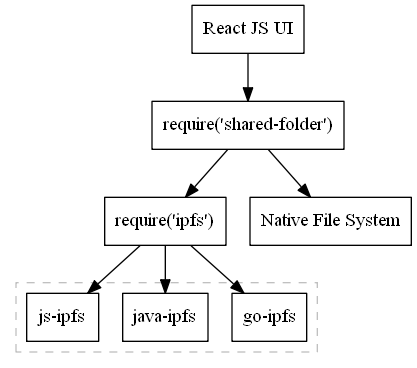

# UI implementation details

First we need to know where this app needs to run:

- Android and iOS phones.
- Windows and MacOS desktops.
- Websites? Someone who doesn't have an app, could go to one of known gateways, enter `FID` and join. JS can store a very limited amount of data locally: a few MBs at most. P2P connectivity is also not easy in client side JS, even with WebRTC DataChannel.
- Linux servers? This type of forum doesn't need servers that would be always online, however deploying a few servers in key geo locations can help a lot with connectivity and latency. Such servers will be like regular clients, except that they will have much higher storage limits and network bandwidth. It's interesting, that it's possible to arrange a forum where such servers would pay for themselves: every post in the forum would need to have a transaction to a bitcoin wallet associated with the servers and the `rules` script will check validity of the attached transaction id.

Writing code is hard, so the less code the better. We can implement all this logic as a [react native](https://github.com/facebook/react-native) app:

- The IPFS core will go to a RN native module, so `require('ipfs')` will pull
  - [go-ipfs](https://github.com/ipfs/go-ipfs) on desktops and servers.
  - [java-ipfs-api](https://github.com/ipfs/java-ipfs-api) on Android
- The additional logic of discovering forum users and syncing the list of files will go to another RN module.
- The app UI will be written in JS React and present the files in the form of a forum with comments and so on.



Possible interface of the `shared-folder` module:

```ts
interface SharedFolder {
  join(id: string): Promise<void>; // finds other peers
  sync(): Promise<void>; // syncs the list of files
  add(path: string, data: string): Promise<void>;
  get(path: string): Promise<string>;
  ls(): Iterable<string>;
}
```
